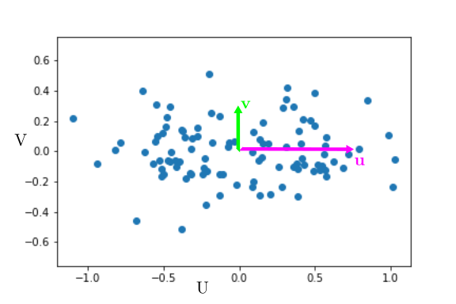
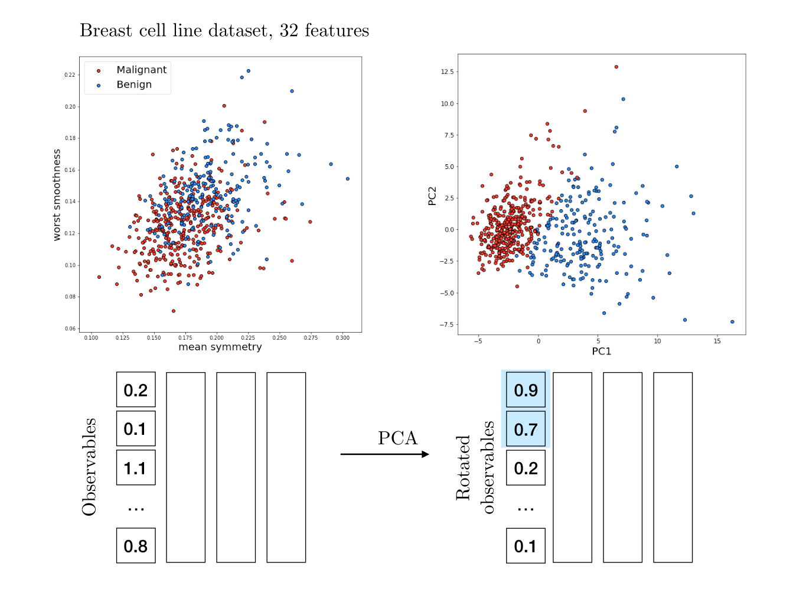

# Finding the center of a space from an object's perspective
What is the link between an animal cell dividing in the correct place (in the middle), and the properties of convex spaces in $n$ dimensions ? Well, there is one !

Finding the center of a space is a common problem in many situations. In cells, is important for the nucleus or the spindle to be located at the cell center, for division to take place at the correct place. We can view the nucleus as an autonomous object without a global knowledge of its environment. How can it find the center of the cell ? This question can be generalized in any dimension, and interesting results appear for convex spaces.

## The nucleus finds the center by applying forces on its environment
In fertilized embryos, the male pronucleus often forms an aster of microtubules - long, stiff filaments. Microtubules exert forces on the environment : either ($i$) being pulled by the boundary (because of molecular motors on the membrane), ($ii$) being pulled in the bulk of the space (by molecular motors in the volume of the cell), or ($iii$) pushing on the boundaries of the space (because of steric repulsion). All three hypothesis have been documented in cells. They are called ($i$) cortical pulling, ($ii$) bulk pulling, ($iii$) cortical pushing.

All three allow centering because the force depend on the distance between the nucleus and the boundary, and the net force ends up towards the center of the cell. I will focus here on cases $ii$ and $iii$, where microtubules are distributed with central symmetry around the nucleus - but their length is the distance from the nucleus to the boundary, they depend on the nucleus position, and are not centrally symmetric.

In the case $ii$, microtubule exert pulling forces, that are proportional to the distance to a positive power (the longer the microtubule, the more it pulls). In case $ii$, microtubules exert pulling forces, that are proportional to the distance to a negative power (the longer the microtubule, the less it pushes). Both mechanisms lead to a net force towards the "center" of the cell.

## Formalism
For simplicity, I will consider here a $n$⁻dimensional space, that is axially symmetric around the axis $Ox$. We can write the mean force on the nucleus as a sum over all angles of the force per unit angle :   
$$ \bar{f}_n^p(x)= \frac{ 1}{\alpha_n } \int_0^\pi \cos{\theta} \sin^{n-2}{(\theta)} l(x,\theta)^p d\theta $$
$$\alpha_n = \frac{\Gamma[\frac{n-1}{2}]}{\Gamma[\frac{n}{2}]} \sqrt{\pi} $$

In which $x$ is the position of the nucleus, $l(x,\theta)$ is the distance between the nucleus (at position $x$ on the axis of symmetry) and the surface, given the angle $\theta$ between $Ox$ and the direction of the force$. $\Gamma$ is the gamma function and $p$ is the power law of the force as a function of distance.

Let us consider two observables $X,Y$ that can be measured experimentally. For example, $X$ could be time and $Y$ could be cell size. For now, we will assume that there is variability on $Y$ but not on $X$.  

The data could look like the following :

  

One usual approach to quantify the correlation between $X$ and $Y$, assuming $X$ to be known precisely, is to fit $Y$ as a linear function of $X$ : $Y=aX+b$ (and here we'll take $b=0$ for simplicity). The most common fitting procedure is to minimize the least square error, i.e. find $a$ that minimizes $<(Y-aX)^2>$.

We can note here that $Y-aX$ is the distance on the $y$ axis between the line $Y=aX$ and the point $X,Y$. It is basically the part of $Y$ that is not explained by the relation $Y=aX$.  

$<(Y-aX)^2>$ is thus the definition of the variance of that is not explained by the fit. Least square fitting thus tries to minimize the unexplained variance, i.e. maximize the *explained* variance.

## PCA finds axes of maximal variance  
Now we will assume that there is also uncertainty on $X$. If $Y$ is cell size, let's say $X$  is cell mass. Even though it may not be a bad idea, we can try to use a linear fit using least mean squares :
  

It's a bad idea to use a linear fit because it does not try to explain the variance on $X$. Thus, it is a much better idea to use a PCA. What the PCA does is find the directions along which variance is maximal. In the example, variance is maximal along the axis $u$, and the remaining variance is along the axis $v$.        

If we represent the data in the new base $u,v$, they would look like :

It is clear that most of the variation is along $u$.  At first glance, if we want to describe the state of the cell, we can just describe its position along $u$ and forget about its position along $v$. Geometrically, the new coordinate $U$ is merely $X+Y$. Basically, cell mass $X$ and cell size $Y$ are the same variable $U$, and $V$ is the unexplained variance, corresponding to biological variability and experimental error. Thus a PCA also aims at maximizing the explained variance !

We have thus effectively reduced the dimensionality of our problem from 2 ($X$ and $Y$) to 1 ($U$). Of course this approach is all the more powerful when the dimensionality is higher - specially because it is hard to visualize and process more than two or three dimensions.

## PCA on breast cancer cells
For the following I took inspiration from [this notebook](https://www.kaggle.com/code/jahirmorenoa/pca-to-the-breast-cancer-data-set/notebook) on breast cancer. Each breast cancer has been characterized by 32 features - the equivalent of our previous observables $X$ and $Y$, just many more. We also know wether these cells are benign or malignant (cancerous).

We cannot unfortunately easily visualize this data, as it lies in a 32-dimensional space. If we look at features two by two, it is not obvious if any individual feature correlates with cells being malignant or not.

It would be really nice to find the two direction along which variation is maximal. Thus we can perform a PCA on the data, and plot only the two first components - since those will contain the largest fraction of the variance. And indeed we see that merely two coordinates can pretty convincingly predict if a cell is malignant or not.

Once again this is not too surprising : cancer has a major impact on cell features and it makes sense that the malignancy shows up in the data. Here, it is clear that merely two dimensions (PCA1 and PCA2) are sufficient to predict if a cell is malignant. We can therefore reduce the  effective dimensionality of the system from 32 to 2 without loosing too much information. Most of the variability is explained by these two dimensions, and the rest of the variance is smaller and less relevant.

Oh and one can see PCA as an "unsupervised" machine learning tool, since we were able to segregate data without guiding the algorithm with the desired outcome. Note that there are many cases where a PCA will not be a good predictor - after all, a PCA is just a rotation in the feature space.
