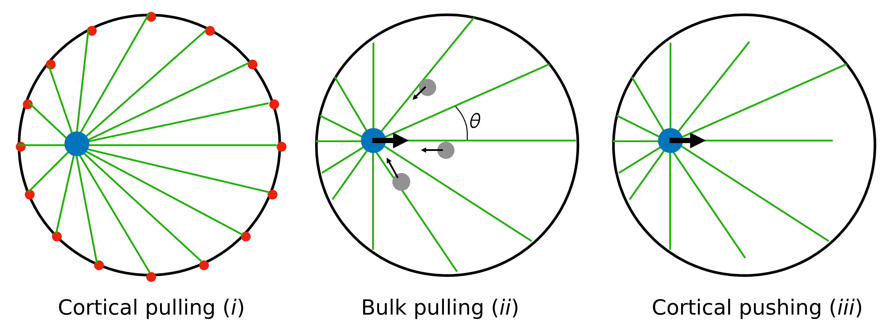

# Finding the center autonomously in convex cells
What is the link between an animal cell dividing in the correct place (in the middle), the properties of convex spaces in $n$ dimensions, and Newton's first theorem ? [Well, there is one](https://iopscience.iop.org/article/10.1209/0295-5075/125/48001/) !

Finding the center of a space is a common problem in many situations. In cells, is important for the nucleus or the spindle to be located at the cell center, for division to take place at the correct place. We can view the nucleus as an *autonomous* object without a global knowledge of its environment. How can it find the center of the cell ? This question can be generalized in any dimension, and interesting results appear for convex spaces.

## The nucleus finds the center by applying forces on its environment
In fertilized eggs, the male pronucleus often forms an aster of microtubules - long, stiff filaments. Microtubules exert forces on the environment : either ($i$) being pulled by the boundary (because of molecular motors on the membrane), ($ii$) being pulled in the bulk of the space (by molecular motors in the volume of the cell), or ($iii$) pushing on the boundaries of the space (because of steric repulsion). All three hypothesis have been documented in cells. They are called ($i$) cortical pulling, ($ii$) bulk pulling, ($iii$) cortical pushing.

  

All three allow centering because the force depend on the distance between the nucleus and the boundary, and the net force ends up towards the center of the cell. I will focus here on cases $ii$ and $iii$, where microtubules are distributed with central symmetry around the nucleus - but their lengths are the distance from the nucleus to the boundary, they depend on the nucleus position, and are not centrally symmetric.

In the case $ii$, microtubule exert pulling forces, that are proportional to the distance to a positive power (the longer the microtubule, the more it pulls). In case $iii$, microtubules exert pushing forces, that are proportional to the distance to a negative power (the longer the microtubule, the less it pushes). Both mechanisms lead to a net force towards the "center" of the cell. [See the article for more details](https://iopscience.iop.org/article/10.1209/0295-5075/125/48001/)

## Formalism
For simplicity, I will consider here a $n$ -dimensional space, that is axially symmetric around the axis $Ox$. We can write the mean force on the nucleus as a sum over all angles of the force per unit angle :   
$$ \bar{f}_n^p(x)= \frac{ 1}{\alpha_n } \int_0^\pi \cos{\theta} \sin^{n-2}{(\theta)} l(x,\theta)^p d\theta $$
$$\alpha_n = \frac{\Gamma[\frac{n-1}{2}]}{\Gamma[\frac{n}{2}]} \sqrt{\pi} $$

In which $x$ is the position of the nucleus, $l(x,\theta)$ is the distance between the nucleus (at position $x$ on the axis of symmetry) and the surface, given the angle $\theta$ between $Ox$ and the direction of the force. $ \Gamma  $  is the gamma function and $ p $ is the power law of the force as a function of distance.

Thus the mean force seems to strongly depend on the form of $l(x,\theta)$, which depends on the shape of the space. We can already verify interesting properties though, and there is an analytical expression for the mean force in an $n$-sphere for any $ p $. For a 3D sphere with $p=-2$ (which is the exponent for gravity), we indeed find $\bar{f}_3^{-2}(x)=0$, in agreement with Newton's first theorem. 

For other shapes, results may be complicated, by we can define $\bar{l}_n^p(x)$,  the fraction of space visible from the position $x$ : 
$$\bar{l}_n^p(x)= \frac{1}{ \alpha_n } \int_0^\pi \sin^{n-2}{(\theta)} l(x,\theta)^p d\theta $$

For a convex space, $\bar{l}_n^n(x)$ is $1$ by definition - although a weaker hypothesis than convexity might be formulated.

## Convex spaces in n dimensions
Using the property that  $\bar{l}_n^p(x)=1$ for a convex space, we were able to show that :  
$$\bar{f}_n^{n+1}(x)=-\frac{n+1}{n}x$$

A pretty neat result. Independently of the shape of the space, the force is linear with $x$ for $p=n+1$ ! For instance, in $3D$, $p=4$ gives a force linear with $x$. Pretty surprising !
However, $p=1$ does not generally lead to a force $\bar{f}_n^{1}$ linear with $x$. 

## What is the cell center ?
In non-spherical cells, the center as found by having a zero mean force is not necessary the center of mass ! Insted, for a given $n$, it depends upon $p$. Finding the center of mass *autonomously* is not that easy !

