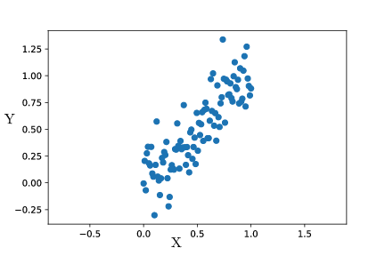
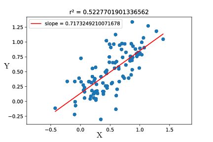
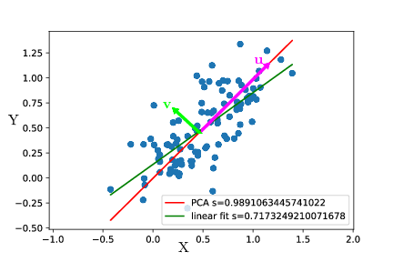

# A minimal introduction to data fitting, PCA, and dimensionality reduction
In this post, I'll give a simple interpretation of PCA, and explain why it allows dimensionality reduction.

## "Fitting data" is minimizing unexplained variance
Let us consider two observables $X,Y$ that can be measured experimentally. For example, $X$ could be time and $Y$ could be cell size. For now, we will assume that there is variability on $Y$ but not on $X$.  

The data could look like the following :

  

One usual approach to quantify the correlation between $X$ and $Y$, assuming $X$ to be known precisely, is to fit $Y$ as a linear function of $X$ : $Y=aX+b$ (and here we'll take $b=0$ for simplicity). The most common fitting procedure is to minimize the least square error, i.e. find $a$ that minimizes $<(Y-aX)^2>$.

We can note here that $Y-aX$ is the distance on the $y$ axis between the line $Y=aX$ and the point $X,Y$. It is basically the part of $Y$ that is not explained by the relation $Y=aX$.  

$<(Y-aX)^2>$ is thus the definition of the variance of that is not explained by the fit. Least square fitting thus tries to minimize the unexplained variance, i.e. maximize the *explained* variance.

## PCA finds axes of maximal variance  
Now we will assume that there is also uncertainty on $X$. If $Y$ is cell size, let's say $X$  is cell mass. Even though it may not be a bad idea, we can try to use a linear fit using least mean squares :
  

It's a bad idea to use a linear fit because it does not try to explain the variance on $X$. Thus, it is a much better idea to use a PCA. What the PCA does is find the directions along which variance is maximal. In the example, variance is maximal along the axis $u$, and the remaining variance is along the axis $v$.

