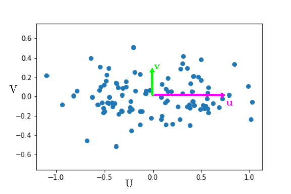
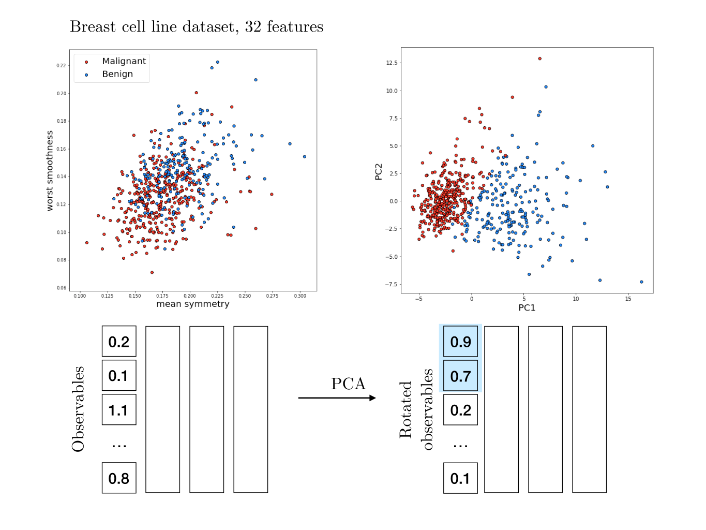

# A minimal introduction to data fitting, PCA, and dimensionality reduction
In this post, I'll give a simple interpretation of PCA, and explain why it allows dimensionality reduction.

## "Fitting data" is minimizing unexplained variance
Let us consider two observables $X,Y$ that can be measured experimentally. For example, $X$ could be time and $Y$ could be cell size. For now, we will assume that there is variability on $Y$ but not on $X$.  

The data could look like the following :

  

One usual approach to quantify the correlation between $X$ and $Y$, assuming $X$ to be known precisely, is to fit $Y$ as a linear function of $X$ : $Y=aX+b$ (and here we'll take $b=0$ for simplicity). The most common fitting procedure is to minimize the least square error, i.e. find $a$ that minimizes $<(Y-aX)^2>$.

We can note here that $Y-aX$ is the distance on the $y$ axis between the line $Y=aX$ and the point $X,Y$. It is basically the part of $Y$ that is not explained by the relation $Y=aX$.  

$<(Y-aX)^2>$ is thus the definition of the variance of that is not explained by the fit. Least square fitting thus tries to minimize the unexplained variance, i.e. maximize the *explained* variance.

## PCA finds axes of maximal variance  
Now we will assume that there is also uncertainty on $X$. If $Y$ is cell size, let's say $X$  is cell mass. Even though it may not be a bad idea, we can try to use a linear fit using least mean squares :
  

It's a bad idea to use a linear fit because it does not try to explain the variance on $X$. Thus, it is a much better idea to use a PCA. What the PCA does is find the directions along which variance is maximal. In the example, variance is maximal along the axis $u$, and the remaining variance is along the axis $v$.        

If we represent the data in the new base $u,v$, they would look like :

It is clear that most of the variation is along $u$.  At first glance, if we want to describe the state of the cell, we can just describe its position along $u$ and forget about its position along $v$. Geometrically, the new coordinate $U$ is merely $X+Y$. Basically, cell mass $X$ and cell size $Y$ are the same variable $U$, and $V$ is the unexplained variance, corresponding to biological variability and experimental error. Thus a PCA also aims at maximizing the explained variance !

We have thus effectively reduced the dimensionality of our problem from 2 ($X$ and $Y$) to 1 ($U$). Of course this approach is all the more powerful when the dimensionality is higher - specially because it is hard to visualize and process more than two or three dimensions.

## PCA on breast cancer cells
For the following I took inspiration from [this notebook](https://www.kaggle.com/code/jahirmorenoa/pca-to-the-breast-cancer-data-set/notebook) on breast cancer. Each breast cancer has been characterized by 32 features - the equivalent of our previous observables $X$ and $Y$, just many more. We also know wether these cells are benign or malignant (cancerous).

We cannot unfortunately easily visualize this data, as it lies in a 32-dimensional space. If we look at features two by two, it is not obvious if any individual feature correlates with cells being malignant or not.

It would be really nice to find the two direction along which variation is maximal. Thus we can perform a PCA on the data, and plot only the two first components - since those will contain the largest fraction of the variance. And indeed we see that merely two coordinates can pretty convincingly predict if a cell is malignant or not.

Once again this is not too surprising : cancer has a major impact on cell features and it makes sense that the malignancy shows up in the data. Here, it is clear that merely two dimensions (PCA1 and PCA2) are sufficient to predict if a cell is malignant. We can therefore reduce the  effective dimensionality of the system from 32 to 2 without loosing too much information. Most of the variability is explained by these two dimensions, and the rest of the variance is smaller and less relevant.

Oh and one can see PCA as an "unsupervised" machine learning tool, since we were able to segregate data without guiding the algorithm with the desired outcome. Note that there are many cases where a PCA will not be a good predictor - after all, a PCA is just a rotation in the feature space.
